# AWS Secure Infrastructure Lab

## Project Overview

This project demonstrates the design, deployment, security, monitoring, and operation of a production-style AWS environment using Terraform Infrastructure as Code (IaC).

The environment was designed following cloud engineering best practices, including private compute resources, controlled network access, automated scaling, centralized logging, monitoring and alerting, web application protection, auditing, and disaster recovery.

The infrastructure includes:

- Custom Amazon VPC
- Public and Private Subnets
- Internet Gateway and NAT Gateway
- Security Groups and IAM Roles
- Private Amazon EC2 Instances
- Application Load Balancer (ALB)
- Launch Templates and Auto Scaling Groups (ASG)
- AWS Systems Manager (SSM)
- Amazon CloudWatch Metrics, Logs, and Alarms
- Amazon Simple Notification Service (SNS)
- AWS CloudTrail
- AWS WAF
- AWS Backup

---

## Architecture Diagram

The final architecture uses a secure public entry point with private backend infrastructure.

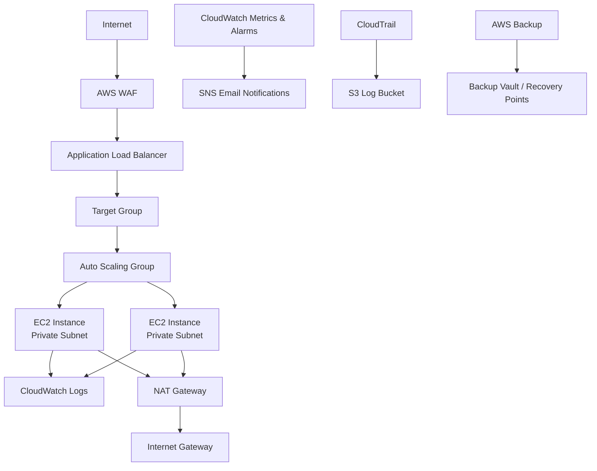

---

## AWS Services Used

- Amazon VPC
- Public and Private Subnets
- Internet Gateway
- NAT Gateway
- Route Tables
- Security Groups
- Amazon EC2
- Application Load Balancer (ALB)
- Target Groups
- Launch Templates
- Auto Scaling Groups (ASG)
- AWS Identity and Access Management (IAM)
- AWS Systems Manager (SSM)
- Amazon CloudWatch Metrics
- Amazon CloudWatch Alarms
- Amazon CloudWatch Logs
- Amazon Simple Notification Service (SNS)
- AWS CloudTrail
- AWS WAF
- AWS Backup

---

## Key Features

### Secure Networking

- Designed a custom VPC architecture with public and private subnets.
- Deployed EC2 instances in private subnets without public IP addresses.
- Configured a NAT Gateway to provide secure outbound internet access for private resources.
- Controlled traffic flow using Security Groups and Route Tables.

### Infrastructure as Code (Terraform)

- Provisioned and managed AWS infrastructure using Terraform.
- Used Terraform workflows including `init`, `validate`, `plan`, `apply`, and `destroy`.
- Created repeatable infrastructure deployments through code.

### Load Balancing and High Availability

- Configured an Application Load Balancer to distribute incoming traffic.
- Implemented Launch Templates and an Auto Scaling Group.
- Verified automatic EC2 replacement after instance termination.

### Monitoring and Alerting

- Created CloudWatch CPU alarms.
- Generated CPU load using the `stress` utility.
- Verified SNS email notifications when alarms entered the ALARM state.

### Logging and Observability

- Installed and configured the CloudWatch Agent.
- Centralized application logs into CloudWatch Logs.
- Troubleshot IAM permission issues preventing log delivery.

### Security and Auditing

- Implemented AWS WAF to protect the Application Load Balancer.
- Used AWS Systems Manager Session Manager for secure private EC2 access.
- Reviewed CloudTrail events to audit infrastructure changes.

### Backup and Disaster Recovery

- Created an AWS Backup Vault and Backup Plan.
- Verified recovery points for disaster recovery.
---

# Challenges Encountered and Solutions

## Issue 1: Private EC2 Could Not Connect Through AWS Systems Manager (SSM)

**Problem:**

The EC2 instance was deployed in a private subnet and could not establish an SSM connection.

**Root Cause:**

The instance initially lacked the required IAM permissions and did not have a network path to reach AWS Systems Manager services.

**Solution:**

- Attached the `AmazonSSMManagedInstanceCore` policy to the EC2 IAM role.
- Configured a NAT Gateway and private route table for outbound internet access.
- Verified successful SSM Session Manager connectivity.

---

## Issue 2: CloudWatch Logs Were Not Appearing

**Problem:**

The CloudWatch Agent was running, but application logs were not visible in CloudWatch Logs.

**Root Cause:**

The EC2 IAM role did not have the required permissions to publish logs.

**Solution:**

- Investigated CloudWatch Agent status and logs.
- Identified an `AccessDenied` permission issue.
- Added the `CloudWatchAgentServerPolicy` IAM policy.
- Restarted the CloudWatch Agent and verified log delivery.

---

## Issue 3: Auto Scaling Target Group Health Failure

**Problem:**

An outdated EC2 instance remained attached to the Application Load Balancer target group and showed as unhealthy.

**Root Cause:**

The target group contained an instance that was no longer managed by the Auto Scaling Group.

**Solution:**

- Investigated target group health checks.
- Identified the unnecessary EC2 target.
- Removed the outdated target and verified all Auto Scaling instances became healthy.

---

## Issue 4: CloudWatch Alarm Did Not Trigger

**Problem:**

The CPU alarm remained in an OK state during testing.

**Root Cause:**

The generated CPU load did not exceed the configured alarm threshold.

**Solution:**

- Increased CPU stress testing.
- Verified CPU utilization exceeded the threshold.
- Confirmed the alarm transitioned into the ALARM state and delivered SNS notifications.

---

## Issue 5: WAF Association Was Lost After Terraform Rebuild

**Problem:**

After destroying and recreating infrastructure with Terraform, the AWS WAF Web ACL existed but was no longer associated with the Application Load Balancer.

**Root Cause:**

The WAF was originally configured manually outside Terraform, causing configuration drift after infrastructure recreation.

**Solution:**

- Added an `aws_wafv2_web_acl_association` Terraform resource.
- Verified the Web ACL was automatically associated with the ALB during future deployments.

**Lesson Learned:**

Critical infrastructure components should be managed as code to prevent configuration drift.

---

## Issue 6: SSM Connection Failed After Auto Scaling Migration

**Problem:**

New Auto Scaling Group EC2 instances appeared healthy and passed load balancer health checks but remained offline in Systems Manager.

**Root Cause:**

The Launch Template was using the Amazon Linux 2023 minimal AMI, which did not include the required SSM Agent. Updating the Launch Template did not automatically replace existing instances.

**Solution:**

- Verified IAM roles, SSM permissions, NAT Gateway connectivity, and private route tables.
- Identified the Launch Template AMI configuration issue.
- Updated Terraform to use the standard Amazon Linux 2023 AMI.
- Replaced old Auto Scaling instances so the ASG launched new instances using the updated Launch Template.
- Confirmed successful Session Manager registration.

**Lesson Learned:**

Changes to Launch Templates apply only to newly created instances. Existing Auto Scaling instances must be replaced to receive updated configurations.

---

## Issue 7: Terraform State Mismatch After Project Restructuring

**Problem:**

After reorganizing the project directories, Terraform generated a plan to recreate the entire infrastructure instead of recognizing existing resources.

**Root Cause:**

Terraform configuration files were moved into a new directory while the Terraform state files remained in the original directory.

**Solution:**

- Identified that the state files were separated from the active Terraform configuration.
- Moved `terraform.tfstate` and `terraform.tfstate.backup` into the correct Terraform working directory.
- Verified the environment with `terraform plan`, which returned:

```
No changes. Your infrastructure matches the configuration.
```

**Lesson Learned:**

Terraform state files are essential for tracking existing infrastructure. Separating state from the active configuration can cause Terraform to attempt to recreate deployed resources.

---

# Project Screenshots

The following screenshots demonstrate the deployment, operation, security, monitoring, and recovery capabilities of the AWS Secure Infrastructure Lab.

---

## Terraform Deployment

### Infrastructure Successfully Provisioned with Terraform

Terraform successfully created and managed the AWS infrastructure using Infrastructure as Code.

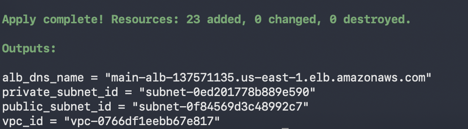

---

## Networking

### Custom VPC Architecture

A dedicated VPC was created to provide isolated networking for the application environment.

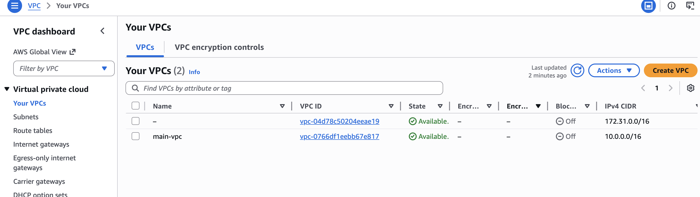

### Public and Private Subnet Configuration

Separate public and private subnets were implemented to isolate backend resources from direct internet access.

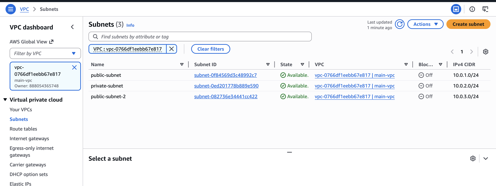

### NAT Gateway for Private Resource Access

The NAT Gateway allows private EC2 instances to access AWS services and updates without exposing them to inbound internet traffic.

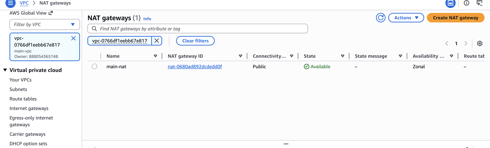

---

## Compute and Auto Scaling

### EC2 Instances Managed by Auto Scaling

Application servers are deployed as private EC2 instances managed by an Auto Scaling Group.

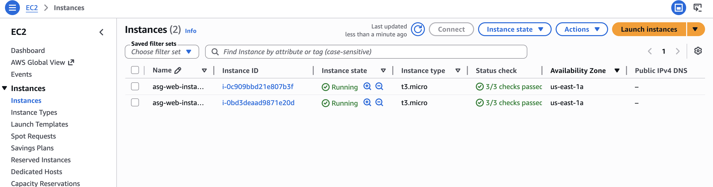

### Auto Scaling Group Maintaining Desired Capacity

The Auto Scaling Group automatically replaces failed instances and maintains application availability.

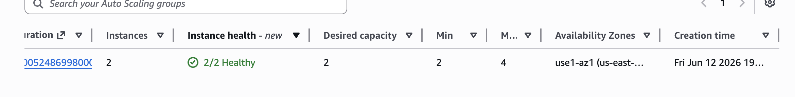

---

## Load Balancing

### Application Load Balancer

The internet-facing Application Load Balancer distributes traffic across healthy private EC2 instances.

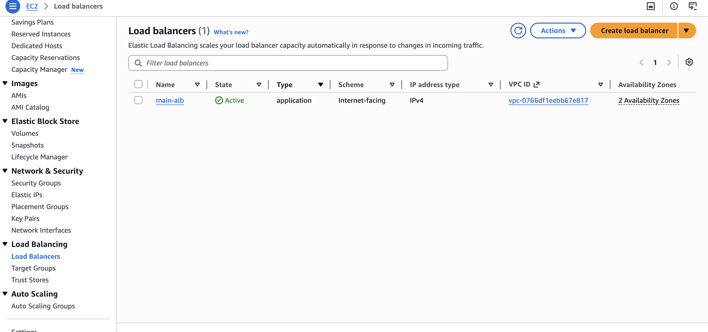

### Target Group Health Checks

Target Group health checks ensure traffic is only routed to healthy application servers.

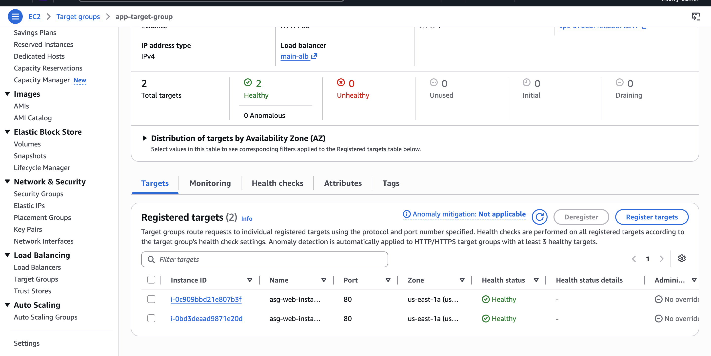

---

## Security

### AWS WAF Protection

AWS WAF protects the Application Load Balancer using managed security rules.

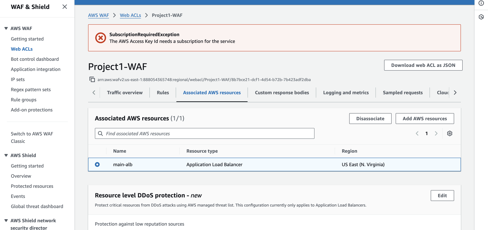

### Secure Private EC2 Access with Systems Manager

AWS Systems Manager Session Manager provides secure administrative access to private EC2 instances without public IP addresses or SSH keys.

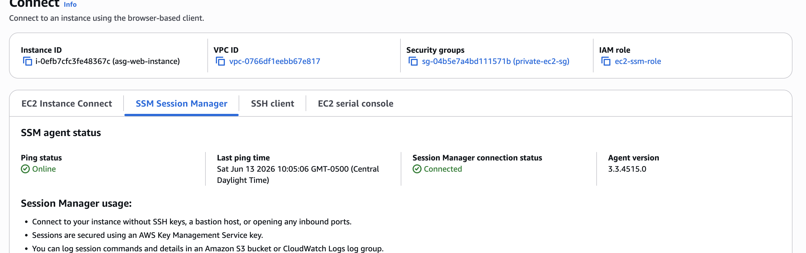

---

## Monitoring and Alerting

### CloudWatch High CPU Alarm

CloudWatch detected high CPU utilization during testing and transitioned the alarm into the ALARM state.

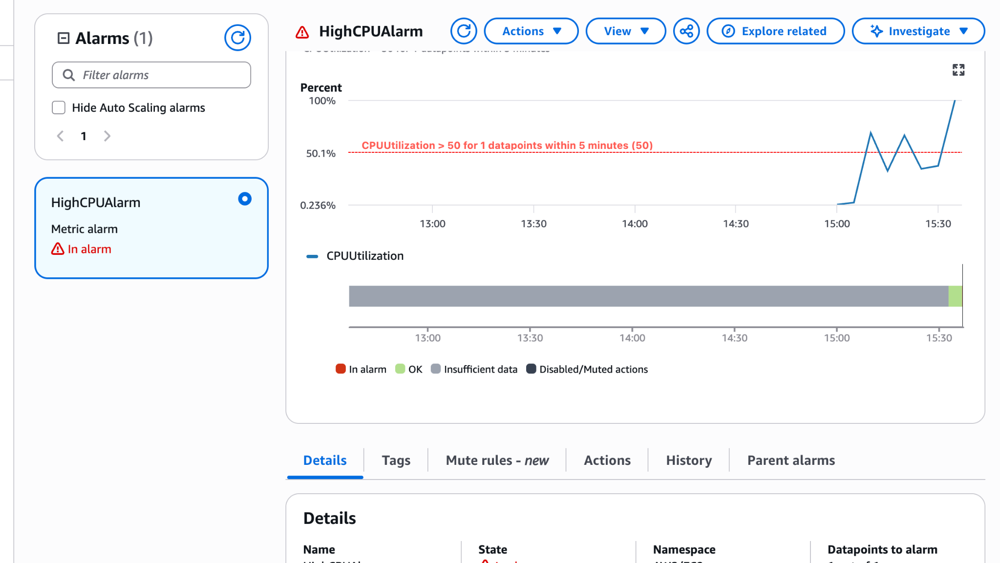

### SNS Email Notification

Amazon SNS delivered an email alert when the CloudWatch alarm was triggered.

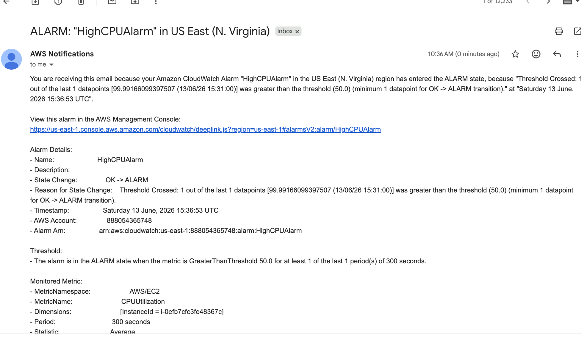

---

## Backup and Disaster Recovery

### AWS Backup Recovery Points

AWS Backup stores recovery points to support disaster recovery and data protection.

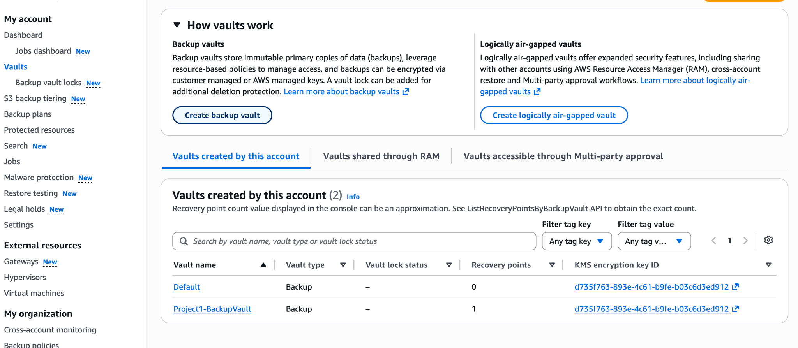

---

## Auditing and Compliance

### CloudTrail Auto Scaling Audit Event

CloudTrail recorded the automatic EC2 termination event performed by the Auto Scaling Group, providing an audit trail of infrastructure changes.

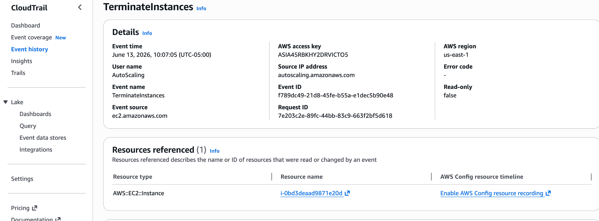

---

# Key Lessons Learned

Through this project, I gained hands-on experience designing, deploying, securing, monitoring, and troubleshooting a production-style AWS environment.

Key lessons include:

- Infrastructure as Code enables repeatable and consistent infrastructure deployments.
- Private cloud resources require both proper IAM permissions and network connectivity to access AWS services.
- Auto Scaling creates resilient, self-healing infrastructure but requires monitoring, backups, and operational tools to account for changing EC2 instances.
- Monitoring and observability are critical for detecting issues before they impact users.
- Security controls should be implemented as code to prevent configuration drift.
- Cloud infrastructure requires continuous troubleshooting and validation, including IAM permissions, networking, logging, monitoring, Auto Scaling, and Terraform state management.

---

# Final Project Summary

This project demonstrates the complete lifecycle of designing, deploying, operating, and maintaining a secure AWS infrastructure environment using Terraform.

The final architecture includes:

- Custom VPC networking with public and private subnets.
- Internet Gateway and NAT Gateway routing.
- Private EC2 instances behind an Application Load Balancer.
- Launch Templates and Auto Scaling Groups for high availability.
- AWS Systems Manager for secure administration.
- CloudWatch metrics, logs, alarms, and SNS notifications for operational monitoring.
- AWS WAF for application-layer security.
- CloudTrail for auditing infrastructure changes.
- AWS Backup for disaster recovery.

Beyond infrastructure deployment, this project included multiple real-world operational issues involving IAM permissions, SSM connectivity, CloudWatch logging, Auto Scaling behavior, WAF configuration drift, and Terraform state management.

The experience demonstrates not only the ability to provision cloud resources, but also the ability to investigate failures, identify root causes, and implement effective solutions—skills required of cloud, infrastructure, and DevOps engineers.

### Infrastructure

- Terraform project structure
- Terraform apply output
- VPC and subnet configuration

### Application & Networking

- Application Load Balancer
- Target Group health checks
- EC2 instances in private subnets

### Security

- IAM roles and attached policies
- AWS WAF Web ACL association with Application Load Balancer
- Security Group rules

### Monitoring & Logging

- CloudWatch CPU alarm
- SNS notification email
- CloudWatch Logs and application log streams

### Reliability & Recovery

- Auto Scaling Group replacing a terminated EC2 instance
- CloudTrail events showing EC2 termination and replacement
- AWS Backup Vault and Recovery Points


## Architecture Diagram

